# 🗺️ Curriculum Learning Roadmap & Study Guide

> **Target Path:** Full Stack Developer & SDET / Automation Quality Engineer  
> **Total Duration:** ~20 Weeks (Flexible / Self-Paced)  
> **Workspace Location:** `C:\Users\rohit\Documents\learning-projects\`  
> **Master Index Launchpad:** [index.html](file:///C:/Users/rohit/Documents/learning-projects/index.html)

---

## 📊 Visual Learning Roadmap Diagram

```mermaid
flowchart TD
    subgraph PHASE1["Phase 1: Foundations (Weeks 1–3)"]
        HTML["1. html-css-essentials\n(3 Parts • HTML5, A11y, Flexbox, Grid)"]
        GIT["2. git-essentials\n(3 Parts • Git CLI, Staging, Branches, PRs)"]
    end

    subgraph PHASE2["Phase 2: Core Programming (Weeks 4–7)"]
        JS["3. javascript-essentials\n(3 Parts • Core JS, DOM, Async, Visualizers)"]
        DB["4. database-essentials\n(3 Parts • SQL, Tables, Joins, ORMs)"]
    end

    subgraph PHASE3["Phase 3: Backend & Type Safety (Weeks 8–11)"]
        NODE["5. node-express-essentials\n(3 Parts • Event Loop, Express, Middleware, JWT)"]
        TS_TESTER["6. typescript-for-testers\n(2 Parts • TS Primitives, Interfaces, Fixtures)"]
    end

    subgraph PHASE4["Phase 4: Frontend Framework & Design (Weeks 12–14)"]
        REACT["7. react-essentials\n(3 Parts • JSX, Components, Hooks, RTL)"]
        FIGMA["8. figma-to-dev\n(1 Part • Auto Layout, Tokens, Dev Mode)"]
    end

    subgraph PHASE5["Phase 5: Automated Testing & Performance (Weeks 15–18)"]
        PW["9. playwright-essentials\n(3 Parts • E2E, POM Pattern, Network Mocks, CI)"]
        API["10. api-data-essentials\n(3 Parts • REST, JSON Schema, k6 Load Testing)"]
        PERF["11. perf-basics\n(3 Parts • Core Web Vitals, Lighthouse, DevTools)"]
        TS_DEV["12. typescript-develop-test\n(3 Parts • Fullstack TS Build & Test Loop)"]
    end

    subgraph PHASE6["Phase 6: Capstone Projects & Career (Weeks 19–20)"]
        CAP1["13. automation-portfolio\n(Express + Vanilla JS App + Test Suite)"]
        CAP2["14. phase-bc-fullstack-app\n(React + Express + Vite App + E2E Suite)"]
        CAREER["15. automation-tester-path\n(Roadmap, Testing Pyramid, Interview Prep)"]
        CSS_ADV["16. css-advanced\n(3 Parts • Motion, Container Queries, Tokens)"]
    end

    HTML --> GIT
    GIT --> JS
    JS --> DB
    DB --> NODE
    NODE --> TS_TESTER
    TS_TESTER --> REACT
    REACT --> FIGMA
    FIGMA --> PW
    PW --> API
    API --> PERF
    PERF --> TS_DEV
    TS_DEV --> CAP1
    CAP1 --> CAP2
    CAP2 --> CAREER
    CAREER --> CSS_ADV

    style HTML fill:#2b6cb0,color:#fff,stroke:#4299e1
    style GIT fill:#2b6cb0,color:#fff,stroke:#4299e1
    style JS fill:#2b6cb0,color:#fff,stroke:#4299e1
    style DB fill:#2b6cb0,color:#fff,stroke:#4299e1
    style NODE fill:#2b6cb0,color:#fff,stroke:#4299e1
    style TS_TESTER fill:#6b46c1,color:#fff,stroke:#9f7aea
    style REACT fill:#2b6cb0,color:#fff,stroke:#4299e1
    style FIGMA fill:#2b6cb0,color:#fff,stroke:#4299e1
    style PW fill:#6b46c1,color:#fff,stroke:#9f7aea
    style API fill:#6b46c1,color:#fff,stroke:#9f7aea
    style PERF fill:#6b46c1,color:#fff,stroke:#9f7aea
    style TS_DEV fill:#2b6cb0,color:#fff,stroke:#4299e1
    style CAP1 fill:#c05621,color:#fff,stroke:#ed8936
    style CAP2 fill:#c05621,color:#fff,stroke:#ed8936
    style CAREER fill:#276749,color:#fff,stroke:#48bb78
    style CSS_ADV fill:#2b6cb0,color:#fff,stroke:#4299e1
```

---

## 📅 Recommended Step-by-Step Study Guide

### 🔹 Phase 1: Web & Version Control Foundations (Weeks 1–3)
1. **[html-css-essentials](file:///C:/Users/rohit/Documents/learning-projects/html-css-essentials/Html_css_essentials_part1_study_app.html)**
   * Learn semantic HTML5, CSS box model, flexbox, grid, and accessibility (a11y).
2. **[git-essentials](file:///C:/Users/rohit/Documents/learning-projects/git-essentials/Git_essentials_part1_study_app.html)**
   * Master `git init`, staging, commits, branch creation, merging, and GitHub Pull Requests.

---

### 🔹 Phase 2: Core Programming & Data (Weeks 4–7)
3. **[javascript-essentials](file:///C:/Users/rohit/Documents/learning-projects/javascript-essentials/Javascript_essentials_part1_study_app.html)**
   * Master JavaScript fundamentals, DOM manipulation, closures, Promises, and the Event Loop visualizer.
4. **[database-essentials](file:///C:/Users/rohit/Documents/learning-projects/database-essentials/Database_essentials_part1_study_app.html)**
   * Learn relational database tables, SQL queries (`SELECT`, `INSERT`, `UPDATE`), INNER/LEFT joins, and ORM basics (Prisma/Drizzle).

---

### 🔹 Phase 3: Backend & Type Safety (Weeks 8–11)
5. **[node-express-essentials](file:///C:/Users/rohit/Documents/learning-projects/node-express-essentials/Node_express_essentials_part1_study_app.html)**
   * Build Node.js servers, Express routing, middleware chains, REST API controllers, and JWT authentication.
6. **[typescript-for-testers](file:///C:/Users/rohit/Documents/learning-projects/typescript-for-testers/Typescript_for_testers_part1_study_app.html)**
   * Learn TypeScript primitives, interfaces, union types, tsconfig, and migrating JavaScript to TypeScript.

---

### 🔹 Phase 4: Frontend Framework & Design Systems (Weeks 12–14)
7. **[react-essentials](file:///C:/Users/rohit/Documents/learning-projects/react-essentials/React_essentials_part1_study_app.html)**
   * Learn React JSX, functional components, props, `useState`/`useEffect` hooks, and React Testing Library.
8. **[figma-to-dev](file:///C:/Users/rohit/Documents/learning-projects/figma-to-dev/Figma_to_dev_study_app.html)**
   * Learn Figma Dev Mode, mapping Auto Layout to CSS Flexbox, and design token hierarchies.

---

### 🔹 Phase 5: Automated Testing & Performance (Weeks 15–18)
9. **[playwright-essentials](file:///C:/Users/rohit/Documents/learning-projects/playwright-essentials/Playwright_essentials_part1_study_app.html)**
   * Master Playwright E2E testing, auto-waiting locators, Page Object Model (POM), network interception, and CI/CD.
10. **[api-data-essentials](file:///C:/Users/rohit/Documents/learning-projects/api-data-essentials/Api_data_essentials_part1_study_app.html)**
    * Learn REST API testing, authorization headers, JSON Schema validation, and k6 load performance testing.
11. **[perf-basics](file:///C:/Users/rohit/Documents/learning-projects/perf-basics/Perf_basics_part1_study_app.html)**
    * Optimize Core Web Vitals (LCP, INP, CLS), interpret Lighthouse scores, and audit DevTools memory/network.
12. **[typescript-develop-test](file:///C:/Users/rohit/Documents/learning-projects/typescript-develop-test/Typescript_develop_test_part1_study_app.html)**
    * Build and test a real Task Board application using a full TypeScript development and Playwright testing loop.

---

### 🔹 Phase 6: Capstones & Career (Weeks 19–20)
13. **[automation-portfolio](file:///C:/Users/rohit/Documents/learning-projects/automation-portfolio/Automation_portfolio_study_app.html)**
    * Launch and test against a complete Express + Vanilla JS Task Board portfolio application.
14. **[phase-bc-fullstack-app](file:///C:/Users/rohit/Documents/learning-projects/phase-bc-fullstack-app/Phase_bc_fullstack_app_study_app.html)**
    * Launch and test against a full-stack React + Express + Vite capstone application.
15. **[automation-tester-path](file:///C:/Users/rohit/Documents/learning-projects/automation-tester-path/Automation_tester_path_study_app.html)**
    * Review testing pyramid strategies, non-functional testing, career roadmaps, and SDET interview prep.
16. **[css-advanced](file:///C:/Users/rohit/Documents/learning-projects/css-advanced/Css_advanced_part1_study_app.html)** *(Optional Deep Dive)*
    * Explore CSS motion keyframes, 3D transforms, container queries, and subgrid.

---

## 🧠 ADHD / Autism Study Tips

*   **🧘 Use Focus Mode:** Click the `🧘 Focus Mode` button at the top of any study app to hide all headers, footers, and sidebars.
*   **⏱️ Plan around Section Times:** Check the `⏱ ~X min` labels on section headers to chunk your daily study sessions.
*   **🔁 Utilize Flashcards:** Review the Spaced Repetition flashcards at the end of each section to lock in long-term memory.
