# 🗺️ Curriculum Learning Roadmap & Study Guide

> **Target Path:** Full Stack Developer & SDET / Automation Quality Engineer  
> **Actual Learning Path Followed:** JavaScript & Automation Testing First → Web & Design Basics → Core Systems → Test Automation → Full Stack React/Node Advanced → Capstones  
> **Workspace Location:** `C:\Users\rohit\Documents\learning-projects\`  
> **Live Flowchart URL:** [https://rohithr1008.github.io/fullstack-sdet-learning-suite/learning_roadmap.html](https://rohithr1008.github.io/fullstack-sdet-learning-suite/learning_roadmap.html)

---

## 📊 Visual Learning Roadmap Diagram

```mermaid
flowchart TD
    subgraph PHASE1["Phase 1: JS & Tester Foundations (Weeks 1–4)"]
        JS["1. javascript-essentials\n(3 Parts • Core JS, DOM, Async, Visualizers)"]
        TS_TESTER["2. typescript-for-testers\n(2 Parts • TS Primitives, Interfaces, Fixtures)"]
        CAREER["3. automation-tester-path\n(Roadmap, Testing Pyramid, Strategy)"]
    end

    subgraph PHASE2["Phase 2: HTML, CSS & Design Basics (Weeks 5–7)"]
        HTML["4. html-css-essentials\n(3 Parts • HTML5, A11y, Flexbox, Grid)"]
        CSS_ADV["5. css-advanced\n(3 Parts • Motion, Container Queries, Tokens)"]
        FIGMA["6. figma-to-dev\n(1 Part • Auto Layout, Tokens, Dev Mode)"]
    end

    subgraph PHASE3["Phase 3: Core Version Control & Data (Weeks 8–10)"]
        GIT["7. git-essentials\n(3 Parts • Git CLI, Staging, Branches, PRs)"]
        DB["8. database-essentials\n(3 Parts • SQL, Tables, Joins, ORMs)"]
    end

    subgraph PHASE4["Phase 4: Test Automation & Performance (Weeks 11–14)"]
        PW["9. playwright-essentials\n(3 Parts • E2E, POM Pattern, Network Mocks, CI)"]
        API["10. api-data-essentials\n(3 Parts • REST, JSON Schema, k6 Load Testing)"]
        PERF["11. perf-basics\n(3 Parts • Core Web Vitals, Lighthouse, DevTools)"]
    end

    subgraph PHASE5["Phase 5: Full Stack Development & Advanced Loops (Weeks 15–18)"]
        NODE["12. node-express-essentials\n(3 Parts • Event Loop, Express, Middleware, JWT)"]
        REACT["13. react-essentials\n(3 Parts • JSX, Components, Hooks, RTL)"]
        TS_DEV["14. typescript-develop-test\n(3 Parts • Fullstack TS Build & Test Loop)"]
    end

    subgraph PHASE6["Phase 6: Capstone Projects (Weeks 19–20)"]
        CAP1["15. automation-portfolio\n(Express + Vanilla JS App + Test Suite)"]
        CAP2["16. phase-bc-fullstack-app\n(React + Express + Vite App + E2E Suite)"]
    end

    JS --> TS_TESTER
    TS_TESTER --> CAREER
    CAREER --> HTML
    HTML --> CSS_ADV
    CSS_ADV --> FIGMA
    FIGMA --> GIT
    GIT --> DB
    DB --> PW
    PW --> API
    API --> PERF
    PERF --> NODE
    NODE --> REACT
    REACT --> TS_DEV
    TS_DEV --> CAP1
    CAP1 --> CAP2

    style JS fill:#2b6cb0,color:#fff,stroke:#4299e1
    style TS_TESTER fill:#6b46c1,color:#fff,stroke:#9f7aea
    style CAREER fill:#276749,color:#fff,stroke:#48bb78
    style HTML fill:#2b6cb0,color:#fff,stroke:#4299e1
    style CSS_ADV fill:#2b6cb0,color:#fff,stroke:#4299e1
    style FIGMA fill:#2b6cb0,color:#fff,stroke:#4299e1
    style GIT fill:#2b6cb0,color:#fff,stroke:#4299e1
    style DB fill:#2b6cb0,color:#fff,stroke:#4299e1
    style PW fill:#6b46c1,color:#fff,stroke:#9f7aea
    style API fill:#6b46c1,color:#fff,stroke:#9f7aea
    style PERF fill:#6b46c1,color:#fff,stroke:#9f7aea
    style NODE fill:#2b6cb0,color:#fff,stroke:#4299e1
    style REACT fill:#2b6cb0,color:#fff,stroke:#4299e1
    style TS_DEV fill:#2b6cb0,color:#fff,stroke:#4299e1
    style CAP1 fill:#c05621,color:#fff,stroke:#ed8936
    style CAP2 fill:#c05621,color:#fff,stroke:#ed8936
```

---

## 📅 Recommended Step-by-Step Study Guide

### 🔹 Phase 1: JS & Tester Foundations (Weeks 1–4)
1. **[javascript-essentials](javascript-essentials/Javascript_essentials_part1_study_app.html)**
   * Master JS fundamentals, DOM manipulation, closures, Promises, and the Event Loop visualizer.
2. **[typescript-for-testers](typescript-for-testers/Typescript_for_testers_part1_study_app.html)**
   * Learn TypeScript primitives, interfaces, union types, tsconfig, and Playwright fixtures.
3. **[automation-tester-path](automation-tester-path/Automation_tester_path_study_app.html)**
   * Review testing pyramid strategies, manual/automated testing, and SDET interview prep.

---

### 🔹 Phase 2: HTML, CSS & Design Basics (Weeks 5–7)
4. **[html-css-essentials](html-css-essentials/Html_css_essentials_part1_study_app.html)**
   * Learn semantic HTML5, CSS box model, flexbox, grid, and accessibility (a11y).
5. **[css-advanced](css-advanced/Css_advanced_part1_study_app.html)**
   * Explore CSS motion keyframes, 3D transforms, container queries, and subgrid.
6. **[figma-to-dev](figma-to-dev/Figma_to_dev_study_app.html)**
   * Learn Figma Dev Mode, mapping Auto Layout to CSS Flexbox, and design token hierarchies.

---

### 🔹 Phase 3: Core Version Control & Data (Weeks 8–10)
7. **[git-essentials](git-essentials/Git_essentials_part1_study_app.html)**
   * Master git init, staging, commits, branch creation, merging, and GitHub Pull Requests.
8. **[database-essentials](database-essentials/Database_essentials_part1_study_app.html)**
   * Learn relational database tables, SQL queries (SELECT, INSERT, UPDATE), joins, and ORMs.

---

### 🔹 Phase 4: Test Automation & Performance (Weeks 11–14)
9. **[playwright-essentials](playwright-essentials/Playwright_essentials_part1_study_app.html)**
   * Master Playwright E2E testing, locators, Page Object Model (POM), network mocks, and CI.
10. **[api-data-essentials](api-data-essentials/Api_data_essentials_part1_study_app.html)**
    * Learn REST API testing, authorization headers, JSON Schema validation, and k6 load testing.
11. **[perf-basics](perf-basics/Perf_basics_part1_study_app.html)**
    * Optimize Core Web Vitals (LCP, INP, CLS), interpret Lighthouse scores, and audit DevTools.

---

### 🔹 Phase 5: Full Stack Development & Advanced Loops (Weeks 15–18)
12. **[node-express-essentials](node-express-essentials/Node_express_essentials_part1_study_app.html)**
    * Build Node.js servers, Express routing, middleware chains, REST controllers, and JWT auth.
13. **[react-essentials](react-essentials/React_essentials_part1_study_app.html)**
    * Learn React JSX, functional components, props, useState/useEffect hooks, and RTL.
14. **[typescript-develop-test](typescript-develop-test/Typescript_develop_test_part1_study_app.html)**
    * Build and test a real Task Board app using full TS dev and Playwright loop.

---

### 🔹 Phase 6: Capstone Projects (Weeks 19–20)
15. **[automation-portfolio](automation-portfolio/Automation_portfolio_study_app.html)**
    * Launch and test against a complete Express + Vanilla JS Task Board portfolio application.
16. **[phase-bc-fullstack-app](phase-bc-fullstack-app/Phase_bc_fullstack_app_study_app.html)**
    * Launch and test against a full-stack React + Express + Vite capstone application.

---

## 🧠 ADHD / Autism Study Tips

* **🧘 Use Focus Mode:** Click the `🧘 Focus Mode` button at the top of any study app to hide all headers, footers, and sidebars.
* **⏱️ Plan around Section Times:** Check the `⏱ ~X min` labels on section headers to chunk your daily study sessions.
* **🔁 Utilize Flashcards:** Review the Spaced Repetition flashcards at the end of each section to lock in long-term memory.
